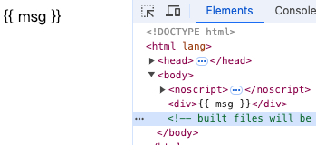

🔥从零手写vue2 - 数据初始化设置以及数据监听

# 一、编译器部分增加 data 解析

前面几节我们实现了从模板编译到渲染页面，基本上展示Vue的基本功能。

但是 Vue强大之处在于数据的使用和监听。

```js
const vm = new Vue({ 
    template:`<div>{{ msg }}</div>`,
    data:{
        msg:'Hello World'
    }
}).$mount("#app"); 
```

如下，我们将上节中写死在模版中的文字放置在 data 的位置。



发现并不能获得我们想要的结果。

他将插值表达式直接当成了文字部分。

因为在模板编译时我们并没有考虑到插值表达式的特殊处理。

在模版编译时，我们直接将文字放在 text中。

```js
chars:(text)=>{
    if(text){
        let res,child;
        // 看看是否能解析到插值表达式
        if(res = parseText(text)){
            child = {
                type: 2,
                expression: res.expression,
                text
            }
        }else{
            child = {
                type:3,
                text
            }
        }
        // 获取栈顶元素 即当前处理中的元素 为文字节点的父元素
        let currentParent = stack[stack.length-1];
        currentParent.children = currentParent.children || [];
        currentParent.children.push(child)
    } 
},

const defaultTagRE = /\{\{((?:.|\r?\n)+?)\}\}/g

export function parseText(text){
    const tagRE = defaultTagRE;
    if (!tagRE.test(text)) {
        return
    }
    let tokens = [];
    // RegExp对象有一个数学叫做 lastIndex,用来记录正则表达式上一次匹配的位置。
    // 这个属性主要用于全局搜索（当使用g标志时），它保存了最后一次匹配结束的位置的索引+1  
    // 使用 test匹配过一次 需要重置 lastIndex 否则无法生效
    tagRE.lastIndex = 0;
    // 匹配模板引擎的占位符
    let match 
    while ((match = tagRE.exec(text))) {
        // 这里的 exp 匹配到的是 {{ }} 中的内容
        const exp = match[1].trim();
        tokens.push(`_s(${exp})`) 
    }
   
    return {
        expression: tokens.join('+')
    }
}
```

在模板解析为 ast的阶段，parseText函数用于解析插值表达式，并且将内容使用`_s()`进行包裹。

`{{ msg }}` 将被转化成 `{type:2,expression:"_s(msg)",text:"{{ msg }}"}`

> 模版编译时我们曾说过：type为 1 代表节点、type为 2 代表有插值表达式的文字、type为 3 代表纯文本。

然后在 ast 转成 render 函数阶段时修改 genText 函数。

如果 type为 2 代表是有插值表达式的文字，直接使用 expression字段。

```js
export function genText(text) {
    return `_v(${
        text.type === 2 
        ? text.expression
        : JSON.stringify(text.text)
    })`
}
```

所以可以知道在vue模板把插值表达式转成了`_s`。

_s和_v一样，是在`installRenderHelpers`中定义的。

```js

/**
 * 转化成 string
 */
export function toString(val) {
  return val == null
    ? ''
    : Array.isArray(val) || (isPlainObject(val) && val.toString === _toString)
    ? JSON.stringify(val, replacer, 2)
    : String(val)
}


function replacer(_key, val) { 
  if (val && val.__v_isRef) {
    return val.value
  }
  return val
}

function installRenderHelpers(target){
    target._s = toString
}
``` 
可以看到会提示 msg 没有定义。

with中的变量会现在绑定的对象上进行查找，如果无法查找就查看本地作用于上是否存在，否则就会报错。

所以现在的问题是 vue实例上没有 msg 属性，那么明明我们已经定义了 data，为啥没有用呢？

因为我们还没有补充这方面相关的逻辑。


# 二、initState 初始化

在构造函数初始化的时候，会调用 initState 进行 data的初始化。

```js
Vue.prototype._init = function(){
    const vm = this;
    // initState调用 进行 data的初始化
    initState(vm)
}

// 这里进行初始化 state、props、computed等 暂时只说data
export function initState(vm) {
    const opts = vm.$options;
    if (opts.data) {
        initData(vm)
    }
}
```

# 三、initData

我们知道data既可以定义成一个对象，也可以定义成一个函数。

如果是一个函数，传入实例直接执行，如果是一个对象，则直接赋值给 `vm._data`。

```js
// 执行 data函数
export function getData(data, vm){
    try{
        return data.call(vm,vm);
    }catch(e){
        return {}
    }
}

function initData(vm){
    let data = vm.$options.data;
    data = vm._data = isFunction(data) ? getData(data, vm) : data || {}
    if(!isPlainObject(data)){
        data = {};
        __DEV__ && 
            warn(
                "data方法应该返回一个对象"
            )
    }
    // 在实例上代理 data
    // 获取 data上所有的 key
    const keys = Object.keys(data);
    let i = keys.length;
    while(i--){
        const key = keys[i];
        // 不以_或者$开头
        if(!isReserved(key)){
            proxy(vm, `_data`, key)
        }
    }
}
```

# 四、对vm.key做代理

如下，对 `vm.key` 做代理。

访问 vm.key 相当于直接获取 vm._data的值。

同理，设置 vm.key 相当于设置 vm._data。 

```js
const sharedPropertyDefinition = {
    enumerable: true,
    configurable: true,
    get: noop,
    set: noop
}

export function proxy(target, sourceKey, key) {
    sharedPropertyDefinition.get = function proxyGetter() {
      return this[sourceKey][key]
    }
    sharedPropertyDefinition.set = function proxySetter(val) {
      this[sourceKey][key] = val
    }
    Object.defineProperty(target, key, sharedPropertyDefinition)
}
```

此时页面已经成功渲染出来了 msg变量的内容。

# 五、编译器部分增加 methods 解析
